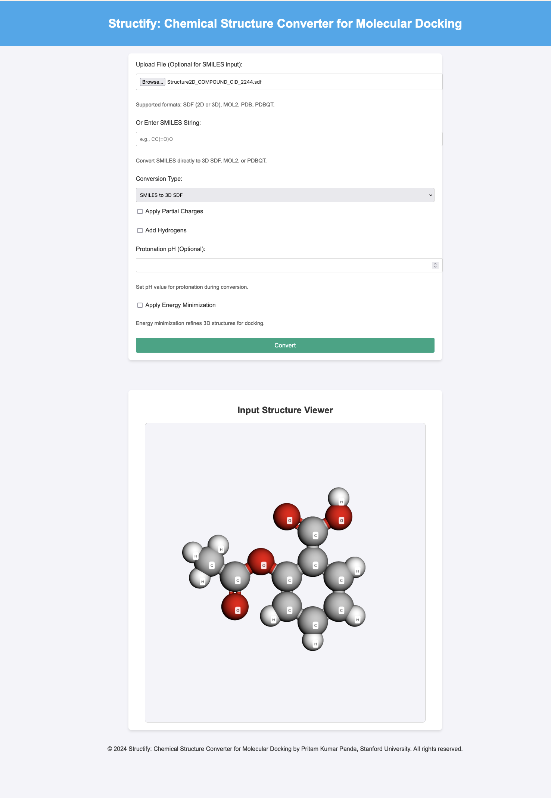

# Structify-Chemical-Structure-Converter
Structify is a lightweight and efficient tool for converting chemical structure file formats. Structify simplifies the process of converting between formats commonly used in computational chemistry and molecular docking workflows. This repository contains a **Flask-based web application** that enables users to convert molecular file formats and manipulate molecular structures. The app supports multiple file formats, performs operations like 2D-to-3D conversion, and allows the addition of hydrogens, partial charges, and energy minimization.

# Access the app here:
https://structify-chemical-structure-converter-j9nxiucrkboccb2yggbwcq.streamlit.app/


## Features

- **File Format Conversions**:
  - Convert between SMILES, SDF, MOL2, PDB, and PDBQT formats.
  - Generate 3D structures from 2D files or SMILES strings.

- **Molecular Structure Enhancements**:
  - Add hydrogens to structures.
  - Apply energy minimization.
  - Compute partial charges (Gasteiger method).
  - Set protonation states at a specific pH.

- **Automatic 2D/3D Detection**:
  - Detects whether an SDF file contains 2D or 3D structures and performs 3D generation when necessary.

- **SMILES Input**:
  - Accepts SMILES strings as input for direct conversion.
  - Remember one thing : For converting 2D SMILES to PDBQT will not work directly. First you have to convert to MOL2 and then that MOL2 file can be converted to PDBQT. In that way it can preserve the structural coordinates.
- **File Upload Support**:
  - Handles various molecular file uploads for conversion.

## Requirements

### Dependencies

Ensure the following are installed on your system:

1. **Python 3.7+**
2. **Open Babel** (command-line tool `obabel`)
3. Python libraries (install via `pip`):
   ```bash
   pip install flask
   ```

### File Structure

```
.
├── app.py                # Main Flask application file
├── uploads/              # Folder for uploaded input files
├── converted/            # Folder for generated output files
├── templates/
│   └── index.html        # HTML template for the web UI
└── README.md             # This readme file
```

## Installation

1. Clone this repository:
   ```bash
   git clone https://github.com/your-username/molecule-converter.git
   cd molecule-converter
   ```

2. Install required Python packages:
   ```bash
   pip install -r requirements.txt
   ```

3. Install Open Babel:
   - For Linux (Ubuntu):
     ```bash
     sudo apt-get install openbabel
     ```
   - For macOS:
     ```bash
     brew install open-babel
     ```
   - For Windows, download and install Open Babel from [Open Babel Downloads](http://openbabel.org/wiki/Category:Installation).

4. Create necessary directories:
   ```bash
   mkdir uploads converted
   ```

## Usage

1. Run the Flask app:
   ```bash
   python app.py
   ```

2. Open your browser and go to:
   ```
   http://127.0.0.1:5000/
   ```

3. Use the web interface to:
   - Input a **SMILES string** or upload a molecular file.
   - Select the desired conversion type.
   - Choose optional enhancements like hydrogens, energy minimization, or partial charges.
   - Download the converted file.

## Supported Conversion Types

| Input Format | Output Format | Notes                                                                 |
|--------------|---------------|----------------------------------------------------------------------|
| SMILES       | SDF, MOL2, PDBQT | Generates 3D structures automatically.                              |
| SDF          | MOL2, PDBQT   | Converts 2D to 3D if necessary.                                      |
| MOL2         | PDBQT         | Adds hydrogens, charges, or energy minimization if selected.         |
| PDB          | PDBQT         | Supports hydrogens, charges, and minimization.                      |

## Advanced Options

- **Protonation pH**:
  - Specify a pH value (0-12) to set protonation states.
  
- **Energy Minimization**:
  - Optimize the molecular geometry.

- **Partial Charges**:
  - Compute and apply Gasteiger partial charges.

## Customization

### HTML Template

To customize the user interface, edit the `index.html` file in the `templates/` directory.

### Logs and Debugging

Run the app in debug mode for detailed logs:
```bash
python app.py
```

## Troubleshooting

1. **Open Babel Not Found**:
   - Ensure `obabel` is installed and accessible from the command line.
   - Add Open Babel to your system PATH.

2. **File Not Converting**:
   - Ensure the input file format is supported and valid.
   - Check for errors in the app log.

3. **Invalid pH Error**:
   - Enter a valid numeric pH value between 0 and 12.

## License

This project is licensed under the MIT License. Feel free to use, modify, and distribute it.

---

## Contribution

Contributions are welcome! To contribute:

1. Fork the repository.
2. Create a new branch:
   ```bash
   git checkout -b feature-name
   ```
3. Commit your changes and push them to your fork.
4. Open a pull request.

---

Enjoy using the Structify Web App! If you encounter any issues or have suggestions, please open an issue on GitHub.


